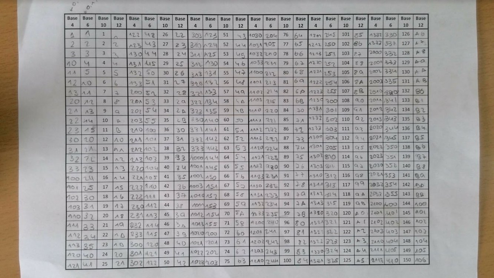
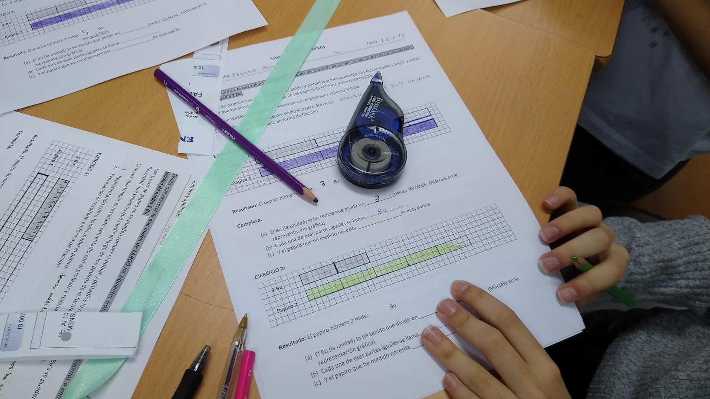

---
title-slide-attributes:
- data-background-image: /assets/intro.jpg
- data-background-size: cover
- data-background-opacity: 0.18
- data-background-color: aquamarine
title: Los materiales manipulativos en el aprendizaje activo y significativo de las matemáticas 
subtitle: 
author: <a href="https://www.tierradenumeros.com">Pablo Beltrán-Pellicer </a>   CPI Val de la Atalaya (María de Huerva), Universidad de Zaragoza     II Jornadas sobre materiales para el aula de matemáticas en primaria   4 de mayo de 2021        <a href="https://pbeltran.github.io/2021-manipulables">https://pbeltran.github.io/2021-manipulativos</a>     
rollingLinks: true
description: Materiales distribuidos bajo licencia CC-BY-SA-4.0 

---

# ¿Qué entendemos por materiales manipulativos? {data-background-image="assets/intro.jpg" data-background-opacity="0.18"}

## Decepcionando de entrada {data-background-image="assets/intro.jpg" data-background-opacity="0.12"}

:::::::::::::: {.columns}

> Una confusión frecuente es pensar, como docentes, que la didáctica nos va a decir cómo enseñar. Resulta que esto es objeto de debate actual entre la comunidad de investigadores. 

::: {.column width="49%"}

- No se va a dar una lista de la compra. 
- No se van a dar recetas mágicas, porque no existen.
- Y, por supuesto, tampoco creo que lo que se vaya a contar sea una gran novedad.

:arrow_forward::arrow_forward::arrow_forward:

:::

::: {.column width="35%"}

{width=90%}  

:::
:::::::::::::

## {data-background-image="assets/intro.jpg" data-background-opacity="0.12"}

{width=100%}  

Fuente: Baroody (1989)

## Modelización en matemáticas {data-background-image="assets/intro.jpg" data-background-opacity="0.12"}

:::::::::::::: {.columns}

::: {.column width="49%"}

> EXPERIMENTALES

- Se utiliza un modelo matemático ya construido.
- Se evalúan las condiciones de aplicación.
- El objetivo es obtener nueva información y realizar predicciones, sobre cierto fenómeno físico.

:::

::: {.column width="49%"}

> MATEMÁTICAS

- En ocasiones se recurre a modelizar cierto fenómeno físico para abstraer las propiedades de un objeto matemático.
- Se pretende construir ese objeto matemático.

:::
:::::::::::::

## ¿Son la solución milagrosa a lo que sea que ocurre en el aula de mates? {data-background-image="assets/intro.jpg" data-background-opacity="0.12"}

> En palabras de Szendrei (1996). Los materiales educativos concretos no son drogas milagrosas. Su uso productivo requiere planificación y previsión. 

:::::::::::::: {.columns}

::: {.column width="49%"}

{width=100%}  

:::

::: {.column width="49%"}

> Rotundamente, no.

Es necesario, como mínimo:

- Que manipulen algo familiar para ellos.
- Que reflexionen sobre las acciones físicas o evocadas que realizan con ellos.

:::
:::::::::::::

## ¿Qué no entendemos por manipulativos? {data-background-image="assets/intro.jpg" data-background-opacity="0.12"}

:::::::::::::: {.columns}

::: {.column width="49%"}

{width=100%}  

Existen versiones «manipulativas» de esto. Por cierto, podríamos hablar de qué hablamos cuando hablamos de «medida».

:::

::: {.column width="49%"}

{width=100%}  

Cuando se usan para elegir los números con que hacer una ficha de cuentas, claro.

:::
:::::::::::::

## Tipos de manipulativos {data-background-image="assets/intro.jpg" data-background-opacity="0.12"}

Por el uso que se les da...

:::::::::::::: {.columns}

::: {.column width="49%"}

{width=80%}  

Para tener algo que contar o a modo de fichas.

:::

::: {.column width="49%"}

{width=70%}  

Actividad de estimación.

:::
:::::::::::::

Físicos :small_orange_diamond: Virtuales

Histórico-culturales :small_orange_diamond: Artificiales

Estructurados :small_orange_diamond: No estructurados

## Por mencionar algo de los virtuales... {data-background-image="assets/intro.jpg" data-background-opacity="0.12"}

> Los manipulativos cobran vida.

{width=100%}  

Conexión entre representaciones y de lo concreto con lo abstracto.

Precisión, escala, disponibilidad, etc.

[Enlace a artículo sobre los Numberblocks](https://www.researchgate.net/publication/348276547_Numberblocks_donde_los_numeros_son_los_protagonistas)

# Consideraciones y malos usos {data-background-image="assets/clase.jpg" data-background-opacity="0.18"}

## Malos usos {data-background-image="assets/clase.jpg" data-background-opacity="0.12"}

> Generalidades

- No considerar las interacciones como algo central del trabajo con manipulativos: los alumnos tienen que expresar sus acciones. Es una oportunidad para que el docente evalúe los razonamientos, permitiendo detectar concepciones y modos de razonamiento.
- No organizar ni planificar bien su uso, atendiendo a la forma en que la manipulación del material representa el objeto matemático en cuestión

## Ábacos {data-background-image="assets/clase.jpg" data-background-opacity="0.12"}

Un mal uso es pensar en los manipulativos como una herramienta para calcular, en lugar de para aprender.

:::::::::::::: {.columns}

::: {.column width="49%"}

{width=80%}  

Esto es un ábaco aditivo (horizontal)

:::

::: {.column width="49%"}

{width=90%}  

Esto es un ábaco posicional (vertical)

:::
:::::::::::::

 
## Regletas de Cuisenaire {data-background-image="assets/clase.jpg" data-background-opacity="0.12"}

:::::::::::::: {.columns}

::: {.column width="49%"}

{width=100%}  

:::

::: {.column width="49%"}

{width=100%}  

:::
:::::::::::::

 
## Regletas de Cuisenaire {data-background-image="assets/clase.jpg" data-background-opacity="0.12"}

:::::::::::::: {.columns}

::: {.column width="49%"}

{width=100%}  

:::

::: {.column width="49%"}

{width=100%}  

:::
:::::::::::::

Fuente: Baroody (1993)

::: notes

- Representan cantidades discretas.
- Como los sitcks se pueden acoplar no es tan sugerente el tratarlos como unidades.
- Se puede recuperar el número que representan con técnicas de conteo.
- Los numerales van en el último bloque --> Cardinalidad
- En tareas de comparación:basadas en técnicas de conteo y recitado.
	
Find Me
What number is more than five but less than nine?

:::

## Regletas de Cuisenaire {data-background-image="assets/clase.jpg" data-background-opacity="0.12"}

> Las regletas de Cuisenaire representan cantidades continuas de magnitud. Exigen medir (y no solo longitud), no contar.

- A edades tempranas se desarrolla una idea discreta de número, contando colecciones de objetos. 
- Alumnos con dificultades llegan a contar las regletas sin atender a su longitud.
- Cuando se quiere asociar una regleta con un número el proceso de conteo puede resultar extraño.
- No conectan por sí mismas modelo concreto de número y símbolo (numeral).
- Permiten establecer situaciones de comparación de cantidades de longitud, pero si las usamos simplemente para comparar 3 vs 4, asumimos que más largo siempre significa mayor que. 

## Regletas de Cuisenaire {data-background-image="assets/clase.jpg" data-background-opacity="0.12"}

{width=100%}  

Fuente: Szendrei (1996)

## Números negativos {data-background-image="assets/clase.jpg" data-background-opacity="0.12"}

> Algo que nos puede llevar a usar mal los manipulables es pensar que los conceptos matemáticos detrás de la manipulación se ven fácilmente. Para el alumnado no es tan evidente.

Por ejemplo, no existe [ningún modelo concreto](https://www.cambridgemaths.org/espresso/view/introducing-negative-numbers/) (manipulativo o evocado) que reproduzca de forma intuitiva la estructura de los números enteros. Los «no entiendo» de los alumnos tendrán que ver con la naturaleza del objeto matemático que hay detrás.

{width=40%}  

Los «no entiendo» de los alumnos tendrán que ver con la naturaleza del objeto matemático que hay detrás.

# Algunos ejemplos

## Algoritmos tradicionales de las operaciones

:::::::::::::: {.columns}

::: {.column width="49%"}

- Tienen su espacio en una secuencia desde la comprensión.
- Previamente, y en paralelo, se debe seguir privilegiando el cálculo oral y las situaciones concretas (problemas).
- Son algoritmos cuyo estudio permite ganar comprensión del sistema decimal posicional.

:::

::: {.column width="49%"}

{width=90%}  

:::
:::::::::::::

## Previamente

Técnicas de cálculo oral. 
Ábaco.

## Una opción

:::::::::::::: {.columns}

::: {.column width="49%"}

Utilizar puntos, barras y placas para los de la suma y la resta.

{width=60%}  

Plantillas que usamos en [\@dm_unizar](https://twitter.com/dm_unizar): [puntos](assets/images/plantillasunidades.pdf), [barras](assets/images/plantillasdecenas.pdf)
y [placas](assets/images/plantillascentenas.pdf)

:::

::: {.column width="49%"}

Utilizar billetes u otro material estructurado de base 10 para la multiplicación y la división.

{width=90%}  

:::
:::::::::::::

## División

## ¿Tiene sentido?

:::::::::::::: {.columns}

::: {.column width="49%"}

{width=90%} 

:::

::: {.column width="49%"}

¿Qué sentido tiene tener al alumnado bajando ceros de las nubes?

Si no profundizas en el significado de esas operaciones:

- O se hacen mentalmente con cualquier otra estrategia.
- O con calculadora.

:::
:::::::::::::

## 

## Números {data-background-image="assets/images/contar2.jpg" data-background-opacity="0.2"}

:::::::::::::: {.columns}

::: {.column width="35%"}
{width=100%}

:::

::: {.column width="65%"}

{width=100%}

:::
:::::::::::::

## Números {data-background-image="assets/images/contar2.jpg" data-background-opacity="0.2"}

{width=90%}

## Números {data-background-image="assets/images/contar2.jpg" data-background-opacity="0.2"}

{width=80%}

## Números racionales {data-background-image="assets/images/medida2.jpg" data-background-opacity="0.2"}

:::::::::::::: {.columns}

::: {.column width="40%"}

{width=100%}

:::

::: {.column width="60%"}

> Los diferentes significados son un conocimiento especializado.

- Parte-todo.
- Medida.
- Cociente.
- Razón.
- Probabilidad.

:::
:::::::::::::

## Números racionales {data-background-image="assets/images/medida2.jpg" data-background-opacity="0.2"}

{width=80%}

Materiales de [SergioMJGR](https://twitter.com/SergioMJGR) y [auroradp64](https://twitter.com/auroradp64), basadas en trabajos de Escolano, Gairín y otros.

## Números racionales {data-background-image="assets/images/medida2.jpg" data-background-opacity="0.2"}

{width=90%}

## Números racionales {data-background-image="assets/images/medida2.jpg" data-background-opacity="0.2"}

{width=90%}

## Números racionales {data-background-image="assets/images/medida2.jpg" data-background-opacity="0.2"}

{width=70%}

## Números racionales {data-background-image="assets/images/medida2.jpg" data-background-opacity="0.2"}

{width=52%}

## Geometría: áreas

{width=90%}

# ¿Alguna pauta? {data-background-image="assets/horizon.jpg" data-background-opacity="0.18"}

## Criterios para seleccionar manipulativos {data-background-image="assets/horizon.jpg" data-background-opacity="0.12"}

Clements & McMillen (1996)

- Fundamentalmente, son para uso del alumnado.
- Deben permitir poner en juego estrategias informales del alumnado.
- Cuidado con seleccionar material estructurado antes de tiempo. Se corre el riesgo de crear un nuevo sistema de numerales.
- Privilegiar los manipulativos de largo recorrido (policubos, por ejemplo).
- Elegirlos de manera que representen adecuadamente el objeto matemático en cuestión y permita la reflexión sobre sus propiedades.
- Cuando se introduce un objeto matemático, considerar las ventajas de ceñirse al empleo de un solo manipulativo. Pero tampoco desdeñar el uso de varios.
- Considerar el empleo de manipulativos virtuales cuando sea adecuado. 

## Consejos clave

- En general, hacer que los manipulativos formen parte del trabajo de aula.
- Familiarizarse con el material antes de lanzarse a elucubrar abstracciones.
- Asumir la diversidad: tiempo, ganancias de aprendizaje...
- 

# Terminando

## Y ahora, ¿qué?
 
 ## ¿Cuándo es adecuado utilizar manipulativos?

> Siempre que el manipulativo resulte familiar o intuitivo y permita organizar una serie de acciones sobre las que reflexionar y que representen bien el objeto matemático en cuestión.
 
 There is no best educational choice between different kinds of manipulatives. Rather the choice depends on different factors (what is available, what fits better the students’ culture and expectations, and so on) and, above all, on teachers’ system of beliefs and view on math- ematics. There is never a “natural” access to the embodied mathematics, as no artifact is transparent in its embodied mathematical mean- ing (Ball 1992; Meira 1998): a suitable context and set of tasks are always required.
 
 

# Créditos y referencias {data-background-image="assets/credits.jpg" data-background-opacity="0.1"}

## Algunas referencias {data-background-image="assets/credits.jpg" data-background-opacity="0.1"}

Baroody, J. (1989). Manipulatives Don’ t Come with Guarantees. *The Arithmetic Teacher, 37*(2), 4–5.

Baroody, A. J. (1993). Introducing Number and Arithmetic Concepts with Number Sticks. *Teaching Exceptional Children, 26*(1), 7–11.

Bartolini M.G., Martignone F. (2014) Manipulatives in Mathematics Education. In: Lerman S. (eds) *Encyclopedia of Mathematics Education*. Springer, Dordrecht. 

Clements, D. H., & McMillen, S. (1996). Rethinking “Concrete” Manipulatives. *Teaching Children Mathematics, 2*(5), 270–279.

Sinclair, N., & Baccaglini-Frank, A. (2016). Digital technologies in the early primary school classroom. En English, L. D., & Kirshner, D. *Handbook of international research in mathematics education*. New York & London: Routledge.

Szendrei J. (1996) Concrete Materials in the Classroom. In: Bishop A.J., Clements K., Keitel C., Kilpatrick J., Laborde C. (eds) *International Handbook of Mathematics Education. Kluwer International Handbooks of Education*, vol 4. Springer, Dordrecht

## Créditos {data-background-image="assets/credits.jpg" data-background-opacity="0.1"}

*Compartir el conocimiento de forma libre es una buena práctica.*

En estas diapositivas se han utilizado materiales disponibles en abierto y se han citado las fuentes correspondientes. El contenido de la presentación está publicado con licencia Creative Common [CC-BY-SA-4.0](https://creativecommons.org/licenses/by-sa/4.0/legalcode.es), lo que quiere decir que puedes compartirla y adaptarla, citándola y poniendo un enlace a la presentación.

> Siéntete libre de trabajar con este material y de contactar para compartir tus reflexiones.

## {data-background-image="assets/credits.jpg" data-background-opacity="0.1"}

Presentación realizada con  <a href="https://revealjs.com/#/">Reveal.js</a>, <a href="https://pandoc.org/">Pandoc</a>, <a href="https://www.mathjax.org/">MathJax</a> y <a href="https://www.markdownguide.org/">Markdown</a>. El código fuente está disponible en [https://github.com/pbeltran](https://github.com/pbeltran/)

La fuente de las imágenes es propia, salvo las que se ha citado la fuente en su diapositiva y las de dominio público obtenidas en [Unsplash](https://unsplash.com).

