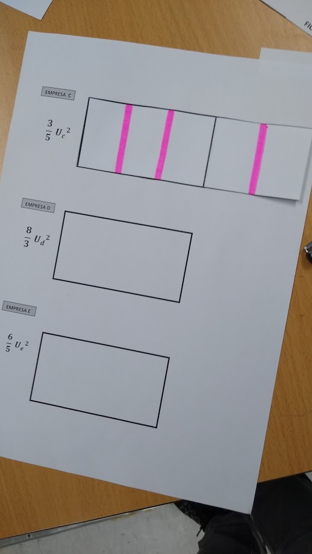
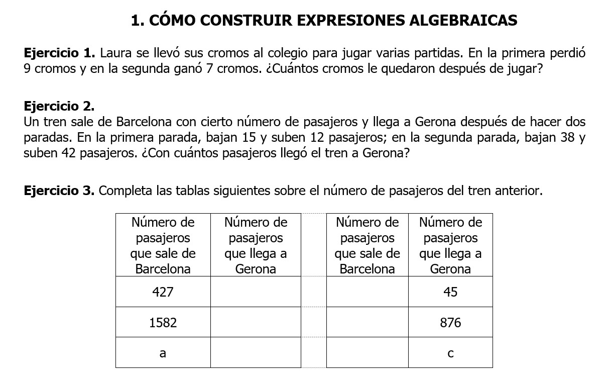

---
title-slide-attributes:
- data-background-image: /assets/intro.jpg
- data-background-size: cover
- data-background-opacity: 0.18
- data-background-color: aquamarine
title: Los materiales manipulativos en el aprendizaje activo y significativo de las matemáticas 
subtitle: 
author: <a href="https://www.tierradenumeros.com">Pablo Beltrán-Pellicer </a>   CPI Val de la Atalaya (María de Huerva), Universidad de Zaragoza     II Jornadas sobre materiales para el aula de matemáticas en primaria   4 de mayo de 2021        <a href="https://pbeltran.github.io/2021-manipulables">https://pbeltran.github.io/2021-manipulativos</a>     
rollingLinks: true
description: Materiales distribuidos bajo licencia CC-BY-SA-4.0 

---

# ¿Qué entendemos por materiales manipulativos? {data-background-image="assets/clase.jpg" data-background-opacity="0.18"}

## Decepcionando de entrada
:::::::::::::: {.columns}

> Una confusión frecuente es pensar, como docentes, que la didáctica nos va a decir cómo enseñar. Resulta que esto es objeto de debate actual entre la comunidad de investigadores. 

::: {.column width="60%"}

- No se va a dar una lista de la compra. 
- No se van a dar recetas mágicas.
- A lo mejor terminamos con más dudas de las que teníamos.

:::

::: {.column width="30%"}

{width=90%}  

:::
:::::::::::::

## Modelización en matemáticas

:::::::::::::: {.columns}

::: {.column width="49%"}

> EXPERIMENTALES

- Se utiliza un modelo matemático ya construido.
- Se evalúan las condiciones de aplicación.
- El objetivo es obtener nueva información y realizar predicciones.

:::

::: {.column width="49%"}

> MATEMÁTICAS

- En ocasiones se recurre a modelizar cierto fenómeno físico para abstraer las propiedades de un objeto matemático.

:::
:::::::::::::

## ¿Qué no entendemos por manipulativos?

:::::::::::::: {.columns}

::: {.column width="49%"}

{width=80%}  

Existen versiones «manipulativas» de esto.

:::

::: {.column width="49%"}

{width=90%}  

Cuando se usan para elegir los números con que hacer una ficha de cuentas, claro.

:::
:::::::::::::

## Tipos de manipulativos

:::::::::::::: {.columns}

::: {.column width="49%"}

{width=80%}  

Para tener algo que contar o a modo de fichas.

:::

::: {.column width="49%"}

{width=90%}  

Ejemplo de actividad de estimación.

:::
:::::::::::::

## Histórico...

## ¿Son la solución milagrosa a lo que sea que ocurre en el aula de mates?

> En palabras de Szendrei (1996). Los materiales educativos concretos no son drogas milagrosas. Su uso productivo requiere planificación y previsión. 

##

In most mathematics classes, the use of physical, tangible models and materials are grudgingly allowed at only the lowest levels of mathematical study; at “higher” levels of mathematics, starting in secondary school or earlier, the use of physical manipulatives for learning is generally considered primitive and babyish. A Socratic-style dialectic (with the lecturer playing both roles—viz Gerofsky, 1996) is very often adopted as the preferred teaching modality, one that immediately recalls a Platonic approach to learning.

p. 63 

Gerofsky, S. (2016). Approaches to Embodied Learning in Mathematics. En English, L. D., & Kirshner, D. Handbook of international research in mathematics education. New York & London: Routledge.

## Manipulables virtuales

The use of digital technologies in the early grades has traditionally encountered opposition by those concerned that children at this age need tactile, concrete experiences. Indeed, the K–2 classroom has long featured the use of physical manipulatives, with both researchers and teachers acknowledging their importance (Sowell, 1989). This presence of a rich set of resources in the classroom may in fact make it easier for digital technologies to be integrated, in comparison to the higher grades where the technologies of paper-and-pencil usually pre- vail. Indeed, over the past decade, several researchers have argued for the appropriateness and benefit of using “virtual manipulatives” (VMs) in the early grades, which build on the famili- arity of physical ones, but which may also provide a range of added affordances (Bolyard & Moyer-Packenham, 2012; Moyer-Packenham & Suh, 2012; Moyer-Packenham, Salkind, Bol- yard, & Suh, 2013). These researchers have questioned the assumption that “concrete” tools are more appropriate for young children and have argued that physical manipulatives are limited in their ability to promote both mathematical actions and reflections on these actions (Sarama & Clements, 2009). Sarama and Clements point specifically to a VM’s potential for supporting the development of integrated-concrete knowledge, which interconnects knowl- edge of physical objects, actions on these objects and symbolic representations of these objects and actions. They offer seven hypothesized, interrelated affordances that have been ratified by an admittedly small amount of existing research: bringing mathematical ideas and action to conscious awareness; encouraging and facilitating complete, precise explanations; supporting mental “actions on objects”; changing the very nature of the manipulative; symbolizing math- ematical concepts; linking the concrete and the symbolic with feedback; and recording and replaying student actions. Thus, one way to approach the design and evaluation of particular tools is to see whether these affordances are present in the tool in a way that is relevant to the mathematical concept under investigation and accessible to both teachers and learners. We will use these affordances as a way of describing and contrasting the various VMs presented in

p.663

Sinclair, N., & Baccaglini-Frank, A. (2016). Digital technologies in the early primary school classroom. En English, L. D., & Kirshner, D. Handbook of international research in mathematics education. New York & London: Routledge.

## Malos usos

- Pensar, como docentes, que los conceptos matemáticos detrás de la manipulación de un material se ven fácilmente. Para el alumnado no es tan evidente.
- No considerar las interacciones como algo central del trabajo con manipulativos: los alumnos tienen que expresar sus acciones. Es una oportunidad para que el docente evalúe los razonamientos, permitiendo detectar concepciones.
- Asumir que son una herramienta de cálculo en lugar de una herramienta para el aprendizaje y la comprensión.
- No organizar ni planificar bien su uso, atendiendo a la forma en que la manipulación del material representa el objeto matemático en cuestión

## ¿Cuándo es adecuado utilizar manipulativos?

> Siempre que el manipulativo permita organizar una serie de acciones que representen bien el objeto matemático en cuestión.

## ¿Cuándo no es adecuado?

## Numberblocks

{width=100%}  

[Enlace](https://www.researchgate.net/publication/348276547_Numberblocks_donde_los_numeros_son_los_protagonistas)

## Regletas de Cuisenaire

Cuestiones problemáticas:

- A edades tempranas, los niños y niñas desarrollan una idea discreta de número, contando colecciones de objetos. Las regletas de Cuisenaire representan cantidades continuas de magnitud. Exigen medir, no contar.
- De hecho, alumnos con dificultades llegan a contar las regletas sin atender a su longitud.
- Cuando se quiere asociar una regleta con un número el proceso de conteo es extraño para el niño, si no 
- No proporcionan una conexión por sí mismas entre el modelo concreto de número y el símbolo (numeral).
- Las regletas permiten establecer situaciones de comparación de cantidades de longitud. Si las usamos para comparar 3 vs 4, asumimos que más largo siempre significa mayor que. 

## Number sticks

- Representan cantidades discretas.
- Como los sitcks se pueden acoplar no es tan sugerente el tratarlos como unidades.
- Se puede recuperar el número que representan con técnicas de conteo.
- Los numerales van en el último bloque --> Cardinalidad
- En tareas de comparación:basadas en técnicas de conteo y recitado.
	
	Find Me
	What number is more than five but less than nine?")

## Ábacos

Un mal uso es pensar en los manipulativos como una herramienta para calcular, en lugar de para aprender.

:::::::::::::: {.columns}

::: {.column width="49%"}

{width=80%}  

Esto es un ábaco aditivo (horizontal)

:::

::: {.column width="49%"}

{width=90%}  

Esto es un ábaco posicional (vertical)

:::
:::::::::::::

## Números negativos

No existe [ningún modelo concreto](https://www.cambridgemaths.org/espresso/view/introducing-negative-numbers/) (manipulativo o evocado) que reproduzca con de forma intuitiva la estructura de los números enteros.

{width=90%}  

# Algunos ejemplos

## Algoritmos tradicionales de las operaciones

:::::::::::::: {.columns}

::: {.column width="49%"}

- Tienen su espacio en una secuencia desde la comprensión.
- Previamente, y en paralelo, se debe seguir privilegiando el cálculo oral y las situaciones concretas (problemas).
- Son algoritmos cuyo estudio permite ganar comprensión del sistema decimal posicional.

:::

::: {.column width="49%"}

{width=90%}  

:::
:::::::::::::

## Previamente

Técnicas de cálculo oral. 
Ábaco.

## Una opción

:::::::::::::: {.columns}

::: {.column width="49%"}

Utilizar puntos, barras y placas para los de la suma y la resta.

{width=60%}  

Plantillas que usamos en [\@dm_unizar](https://twitter.com/dm_unizar): [puntos](assets/images/plantillasunidades.pdf), [barras](assets/images/plantillasdecenas.pdf)
y [placas](assets/images/plantillascentenas.pdf)

:::

::: {.column width="49%"}

Utilizar billetes u otro material estructurado de base 10 para la multiplicación y la división.

{width=90%}  

:::
:::::::::::::

## División

## ¿Tiene sentido?

:::::::::::::: {.columns}

::: {.column width="49%"}

{width=90%} 

:::

::: {.column width="49%"}

¿Qué sentido tiene tener al alumnado bajando ceros de las nubes?

Si no profundizas en el significado de esas operaciones:

- O se hacen mentalmente con cualquier otra estrategia.
- O con calculadora.

:::
:::::::::::::

## 

# Alguna pauta?

## Criterios para seleccionar manipulativos

Clements & McMillen (1996)

- Fundamentalmente, son para uso del alumnado.
- Deben permitir poner en juego estrategias informales del alumnado.
- Cuidado con seleccionar material estructurado antes de tiempo. Se corre el riesgo de crear un nuevo sistema de numerales.
- Privilegiar los manipulativos de largo recorrido (policubos, por ejemplo).
- Elegirlos de manera que representen adecuadamente el objeto matemático en cuestión y permita la reflexión sobre sus propiedades.
- Cuando se introduce un objeto matemático, considerar las ventajas de ceñirse al empleo de un solo manipulativo. Pero tampoco desdeñar el uso de varios.
- Considerar el empleo de manipulativos virtuales cuando sea adecuado. 

## Números {data-background-image="assets/images/contar2.jpg" data-background-opacity="0.2"}

:::::::::::::: {.columns}

::: {.column width="35%"}
{width=100%}

:::

::: {.column width="65%"}

{width=100%}

:::
:::::::::::::

## Números {data-background-image="assets/images/contar2.jpg" data-background-opacity="0.2"}

{width=90%}

## Números {data-background-image="assets/images/contar2.jpg" data-background-opacity="0.2"}

{width=80%}

## Números racionales {data-background-image="assets/images/medida2.jpg" data-background-opacity="0.2"}

:::::::::::::: {.columns}

::: {.column width="40%"}

{width=100%}

:::

::: {.column width="60%"}

> Los diferentes significados son un conocimiento especializado.

- Parte-todo.
- Medida.
- Cociente.
- Razón.
- Probabilidad.

:::
:::::::::::::

## Números racionales {data-background-image="assets/images/medida2.jpg" data-background-opacity="0.2"}

{width=80%}

Materiales de [SergioMJGR](https://twitter.com/SergioMJGR) y [auroradp64](https://twitter.com/auroradp64), basadas en trabajos de Escolano, Gairín y otros.

## Números racionales {data-background-image="assets/images/medida2.jpg" data-background-opacity="0.2"}

{width=90%}

## Números racionales {data-background-image="assets/images/medida2.jpg" data-background-opacity="0.2"}

{width=90%}

## Números racionales {data-background-image="assets/images/medida2.jpg" data-background-opacity="0.2"}

{width=70%}

## Números racionales {data-background-image="assets/images/medida2.jpg" data-background-opacity="0.2"}

{width=52%}

## Álgebra y negativos {data-background-image="assets/images/negativos2.jpg" data-background-opacity="0.16"}

La propuesta de Eva Cid (2017) se apoya en un progresivo quehacer algebraico, de forma similar al recorrido histórico que condujo al reconocimiento de los negativos como números. 

:bulb::bulb::bulb:

> Se trata de un importante cambio conceptual.

[Obstáculos](http://www.quadernsdigitals.net/datos/hemeroteca/r_40/nr_460/a_6233/6233.pdf)

## Álgebra y negativos {data-background-image="assets/images/negativos2.jpg" data-background-opacity="0.16"}

{width=80%}

## Álgebra y negativos {data-background-image="assets/images/negativos2.jpg" data-background-opacity="0.16"}

{width=80%}

## Geometría: áreas

{width=90%}

## ¿Cuándo elegir virtuales?

Cuando es algo que no se pueda hacer con manipulativos físicos.
Cuando presenten una ventaja clara para variar disposiciones, escalas u ofrezcan una precisión extra.

## Consejos clave

- En general, hacer que los manipulativos formen parte del trabajo de aula.
- Familiarizarse con el material antes de lanzarse a elucubrar abstracciones.
- Asumir la diversidad: tiempo, ganancias de aprendizaje...
- 

# Terminando

## Y ahora, ¿qué?
 
 There is no best educational choice between different kinds of manipulatives. Rather the choice depends on different factors (what is available, what fits better the students’ culture and expectations, and so on) and, above all, on teachers’ system of beliefs and view on math- ematics. There is never a “natural” access to the embodied mathematics, as no artifact is transparent in its embodied mathematical mean- ing (Ball 1992; Meira 1998): a suitable context and set of tasks are always required.
 
 

# Créditos y referencias {data-background-image="assets/credits.jpg" data-background-opacity="0.1"}

## Algunas referencias {data-background-image="assets/credits.jpg" data-background-opacity="0.1"}

Baroody, A. J. (1993). Introducing Number and Arithmetic Concepts with Number Sticks. *Teaching Exceptional Children, 26*(1), 7–11.

Bartolini M.G., Martignone F. (2014) Manipulatives in Mathematics Education. In: Lerman S. (eds) Encyclopedia of Mathematics Education. Springer, Dordrecht. 

Clements, D. H., & McMillen, S. (1996). Rethinking “Concrete” Manipulatives. *Teaching Children Mathematics, 2*(5), 270–279.

Szendrei J. (1996) Concrete Materials in the Classroom. In: Bishop A.J., Clements K., Keitel C., Kilpatrick J., Laborde C. (eds) *International Handbook of Mathematics Education. Kluwer International Handbooks of Education*, vol 4. Springer, Dordrecht

## Créditos {data-background-image="assets/credits.jpg" data-background-opacity="0.1"}

*Compartir el conocimiento de forma libre es una buena práctica.*

En estas diapositivas se han utilizado materiales disponibles en abierto y se han citado las fuentes correspondientes. El contenido de la presentación está publicado con licencia Creative Common [CC-BY-SA-4.0](https://creativecommons.org/licenses/by-sa/4.0/legalcode.es), lo que quiere decir que puedes compartirla y adaptarla, citándola y poniendo un enlace a la presentación.

> Siéntete libre de trabajar con este material y de contactar para compartir tus reflexiones.

## {data-background-image="assets/credits.jpg" data-background-opacity="0.1"}

Presentación realizada con  <a href="https://revealjs.com/#/">Reveal.js</a>, <a href="https://pandoc.org/">Pandoc</a>, <a href="https://www.mathjax.org/">MathJax</a> y <a href="https://www.markdownguide.org/">Markdown</a>. El código fuente está disponible en [https://github.com/pbeltran](https://github.com/pbeltran/)

La fuente de las imágenes es propia, salvo las que se ha citado la fuente en su diapositiva y las de dominio público obtenidas en [Unsplash](https://unsplash.com).

